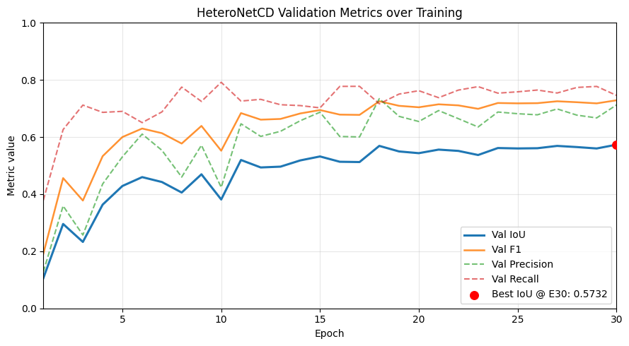
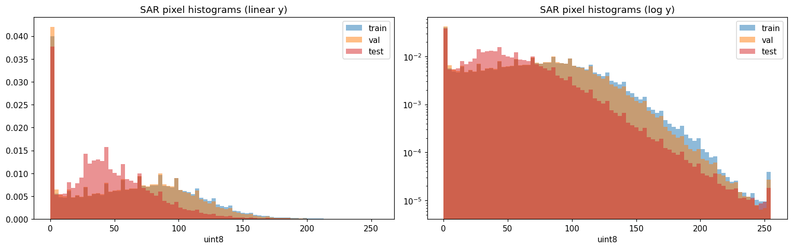
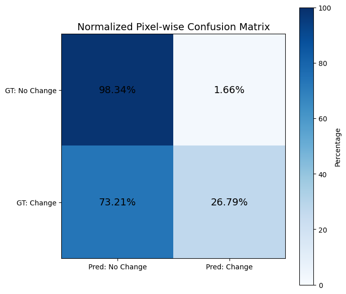
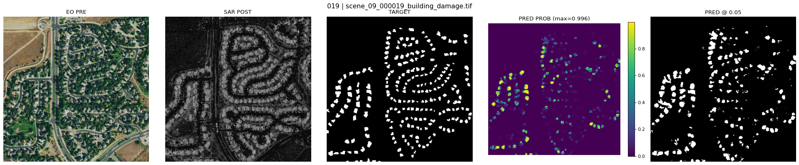

# HeteroNetCD: Heterogeneous Change Detection for EO-SAR Image Pairs

Binary pixel-level change detection on co-registered Electro-Optical (pre-event) and Synthetic Aperture Radar (post-event) image pairs. Built for the GalaxEye AI Research Intern technical assignment.

## What this is

HeteroNetCD is a Siamese-style change detection model designed for cross-modal (EO pre-event, SAR post-event) damage detection. It uses two modality-specific ResNet50 encoders — one pretrained via Self-Supervised Learning on Sentinel-2 ([TorchGeo](https://torchgeo.readthedocs.io)) for EO, and one pretrained via MoCo on Sentinel-1 ([SARhub](https://github.com/sentinel-2-imageprocessing/sarhub)) for SAR. Features are per-channel z-score normalized before differencing to remove encoder-magnitude mismatch, the difference signal is multiplicatively gated by a valid-pixel mask to suppress swath-edge false positives, and a UNet decoder produces a binary change probability map.

Input: 1024×1024 uint8 EO RGB and uint8 single-polarization SAR.
Output: 1024×1024 binary change probability map.

### Results

| Split | IoU | Precision | Recall | F1 | Threshold |
| :--- | :--- | :--- | :--- | :--- | :--- |
| **Validation** | 0.5781 | 0.7404 | 0.7251 | 0.7327 | 0.700 (val-tuned) |
| **Test (visible)** | 0.0474 | 0.1550 | 0.0638 | 0.0904 | 0.700 (val-locked) |
| **Test (visible)** | 0.0983 | 0.1342 | 0.2682 | 0.1789 | 0.050 (test-tuned/oracle) |

**Per-Scene Breakdown (Test-Tuned @ 0.050):**
* **Scene 09:** IoU = 0.1146 | Precision = 0.1476 | Recall = 0.3394
* **Scene 10:** IoU = 0.0807 | Precision = 0.1180 | Recall = 0.2032
  
See the technical report (in ZIP) for the full results table, threshold sweep, and discussion of the val/test calibration gap.

### Training Curves

<p align="center">
  
</p>

### SAR Channel Distribution

<p align="center">
  
</p>

### Confusion Matrix (Test @ 0.05)

<p align="center">
  
</p>

### Test Visualization

<p align="center">
  
</p>

## Setup

```bash
pip install -r requirements.txt
```

That's it. The trained checkpoint contains everything else (model weights, SAR normalization stats, training config).

## Evaluation

Download the trained checkpoint:


**[HeteroNetCD checkpoint (Google Drive)](https://drive.google.com/file/d/1MqrCCYe35jRLUpY16ohPDmmhO3LgXUWu/view?usp=sharing)**

Then run:

```bash
python eval.py \
    --data_path /path/to/dataset \
    --split test \
    --weights /path/to/HeteroNetCD.pt
```

`--data_path` must point to a directory containing `pre-event/`, `post-event/`, and `target/` subdirectories (or contain a `test/` subdirectory with the same structure). The dataloader applies the mandatory binary remap automatically: `{0, 1} → 0` (no-change) and `{2, 3} → 1` (change).

Outputs:
- `metrics.json` — IoU, Precision, Recall, F1 across a threshold sweep, plus per-scene breakdown if multiple scenes are present
- Optional qualitative visualizations (5-panel: EO, SAR, target, prediction probability, binary prediction)

For visualizations:

```bash
python eval.py \
    --data_path /path/to/dataset \
    --split test \
    --weights /path/to/HeteroNetCD.pt \
    --visualize \
    --output_dir ./eval_output
```

The default threshold is read from the checkpoint config. To override:

```bash
python eval.py --weights HeteroNetCD.pt --data_path /path/to/data --threshold 0.05
```

## Dataset structure expected

```text
/path/to/dataset/
├── pre-event/
│   └── *.tif    (3-channel uint8 RGB)
├── post-event/
│   └── *.tif    (1-channel uint8 SAR)
└── target/
    └── *.tif    (1-channel uint8, 4-class, remapped to binary)
```

Or with split subdirectories:

```text
/path/to/dataset/
└── test/
    ├── pre-event/
    ├── post-event/
    └── target/
```

In the second case, pass:

```bash
--split test
```

(or `val`). The script will append the split name to `data_path`.

## Training

The model was trained on the provided dataset with the following:

- 30 epochs, batch size 8, image size 1024×1024
- AdamW optimizer, learning rate 1e-4, cosine schedule with 5% warmup
- bf16 mixed precision
- Combined Focal BCE (γ=2, pos_weight=2) + Focal Tversky (α=β=0.5) loss
- Aggressive EO color augmentation (RandomBrightnessContrast, Gamma, HSV, CLAHE)
- Mild SAR brightness augmentation
- Joint geometric augmentation (flips, rotations, small affine)

To reproduce training:

```bash
python train.py --data_path /path/to/dataset
```

This requires the SARhub MoCo weights for SAR encoder initialization **[LINK](https://drive.google.com/file/d/1HuzkOBHQK0NxWMKqA7ItEWifzYch2jxp/view?usp=drive_link)** .

## Hardware used

- Local data inspection and preprocessing: RTX 5070 (8 GB) laptop GPU
- Most training and inference: Google Colab free-tier T4 (16 GB) 
- Final training run: Google Colab A100 (40 GB) for ~3 hours

## License

MIT
